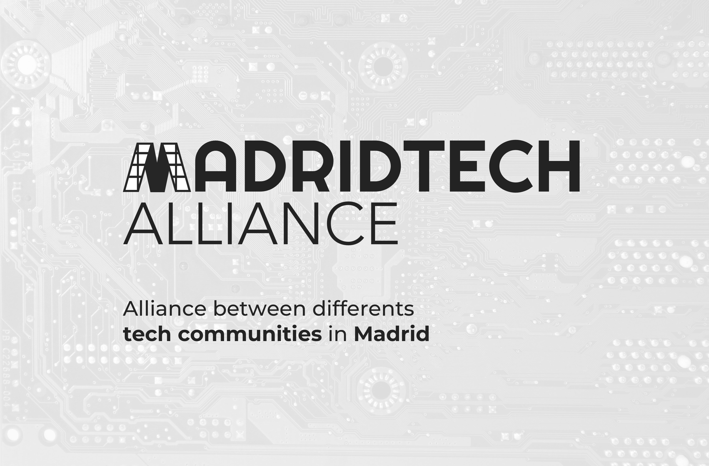

# Identidad Visual VigoTech Alliance


## Tipografía
Utilizamos las siguientes tipografías:
* [Righteous](https://fonts.google.com/specimen/Righteous) para las palabras *Madrid* y *Tech*.
* [Avenir](https://www.fonts.com/font/linotype/avenir) para la palabra *Alliance*.
* [Montserrat](https://fonts.google.com/specimen/Montserrat) para la frase descriptiva.

## Estudio Cromático
Para una mayor homogenización de los elementos cromáticos, se presenta en este apartado las referencias Pantone de los colores señalados como corporativos, así como sus equivalencias en cuatricromía y otros formatos digitales.

### Color Principal
```
Pantone 7737 C
CMYK 26, 0, 66, 29
Hex #84B43D
RGB 132, 180, 61
```


